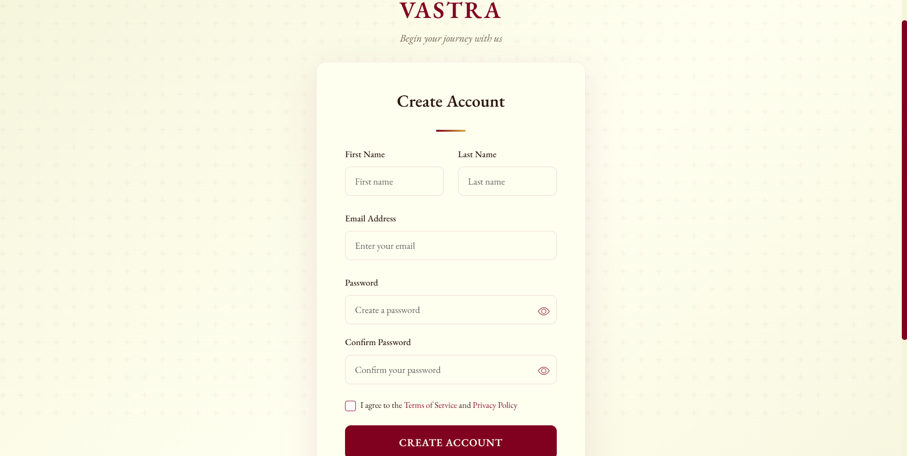
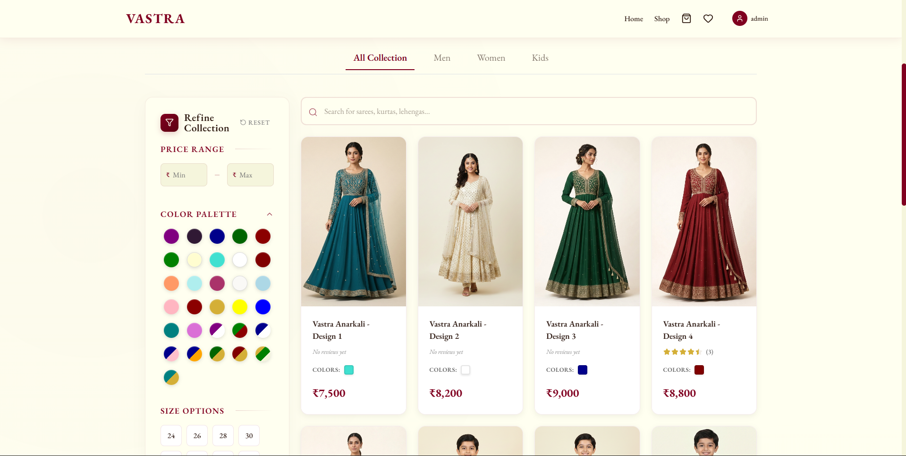
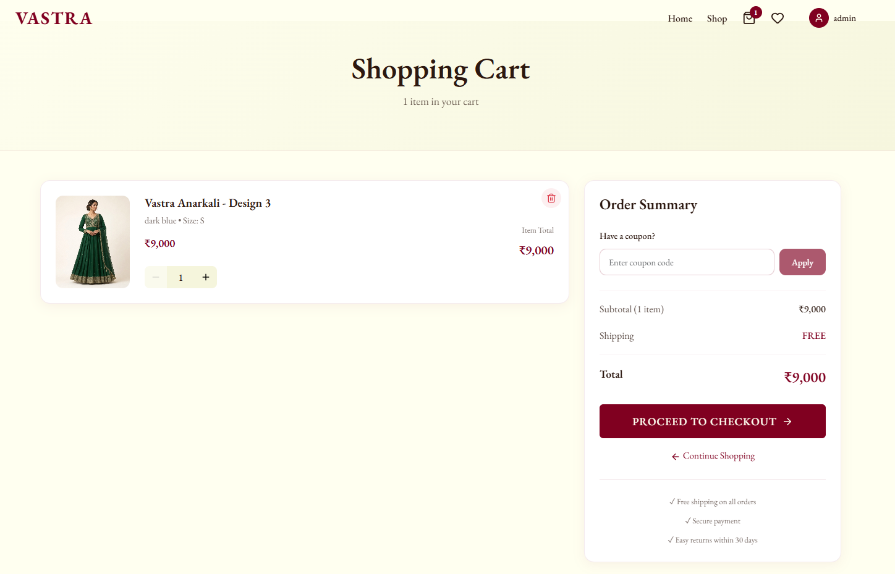
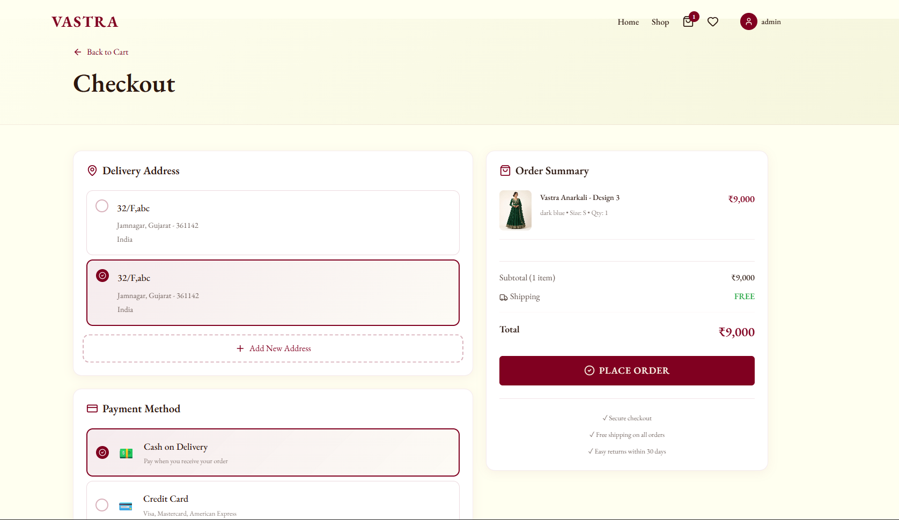
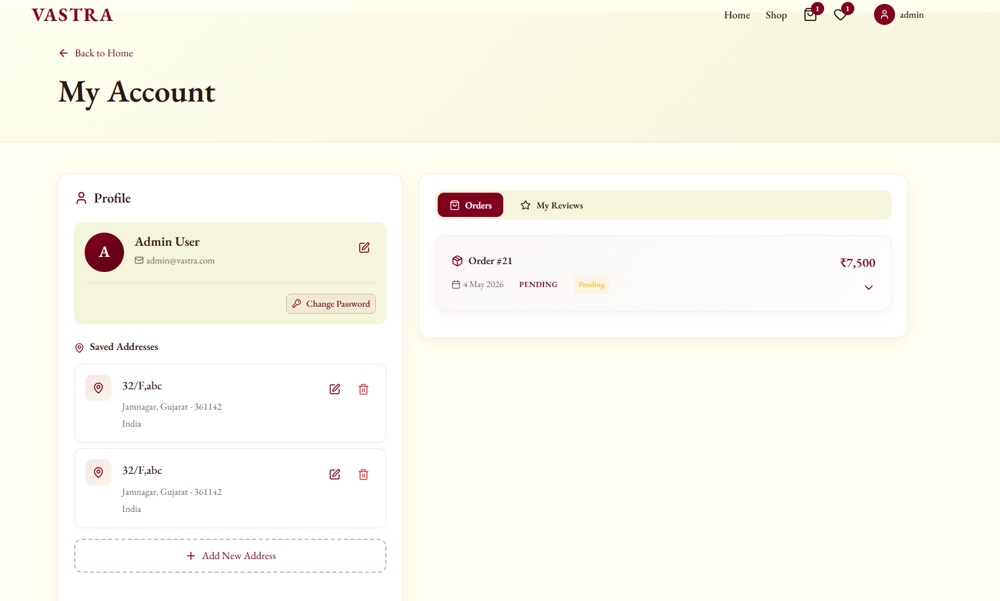
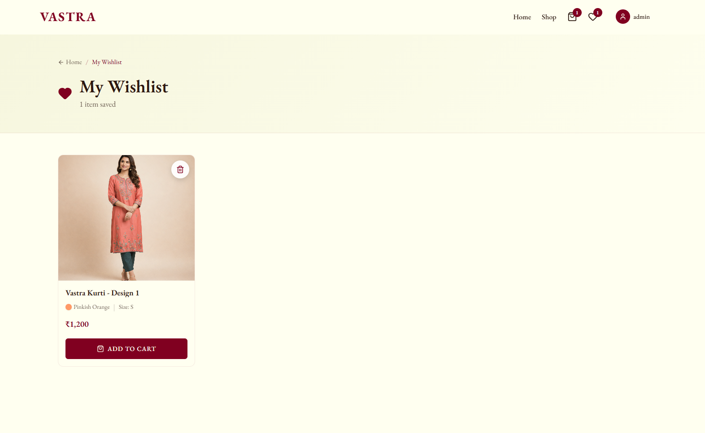
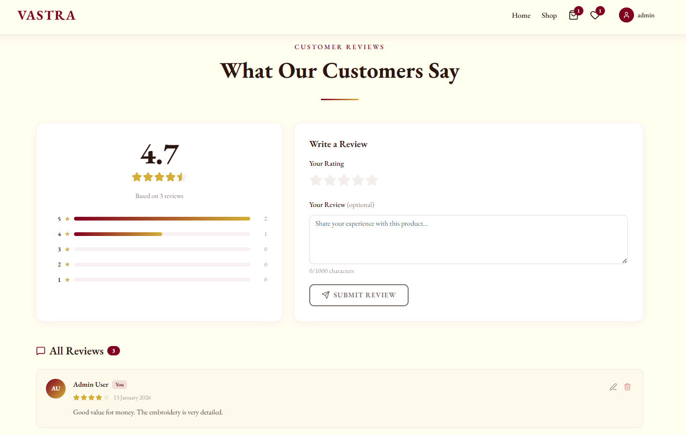
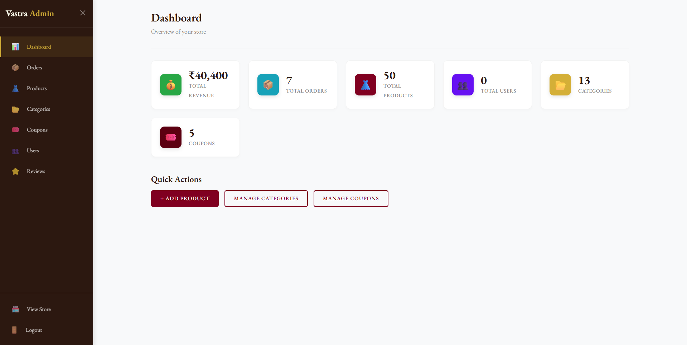

# Vastra

Vastra is a full-stack ecommerce web application built with a .NET Web API backend and a React frontend. It is designed to support a modern online shopping experience with customer authentication, product browsing, cart and checkout flows, order management, and an admin-friendly management surface.

The application uses a layered backend architecture with ASP.NET Core, Entity Framework Core, JWT authentication, FluentValidation, Swagger, and SQL Server, while the frontend is built with React, Vite, Axios, React Router, Bootstrap, and Framer Motion.

## Features

- Authentication and authorization: Secure sign-in, sign-up, and protected routes using JWT-based authentication.
<!-- Replace this image -->


- Product browsing and search: Browse products, view details, filter by category, and discover featured items.
<!-- Replace this image -->


- Shopping cart: Add items to the cart, update quantities, and review totals before checkout.
<!-- Replace this image -->


- Checkout and payment flow: Capture shipping details, apply coupons, and complete payment through the configured gateway.
<!-- Replace this image -->


- Order management: View order history, inspect order details, and track order status changes.
<!-- Replace this image -->


- Wishlist: Save products for later and move items from wishlist to cart when ready to buy.
<!-- Replace this image -->


- Reviews and ratings: Let customers share feedback on products and help other shoppers make informed decisions.
<!-- Replace this image -->


- Admin panel: Manage products, categories, users, coupons, and other ecommerce data from an administrative interface.
<!-- Replace this image -->


## Tech Stack

- Frontend: React, Vite, React Router, Axios, Bootstrap, React Bootstrap, Framer Motion, Lucide React
- Backend: .NET 8 Web API, ASP.NET Core Identity, JWT Bearer Authentication, Entity Framework Core, FluentValidation, Swagger / OpenAPI
- Database: SQL Server
- Payments: Razorpay integration
- Email: SMTP-based email service

## Prerequisites

Make sure the following tools are installed before you begin:

- Node.js 18+ and npm
- .NET SDK 8.0
- SQL Server or SQL Server LocalDB
- Git
- A code editor such as Visual Studio Code or Visual Studio

## Installation & Setup

### 1. Clone the repository

```bash
git clone <repository-url>
cd your-repository-folder
```

### 2. Set up the backend (.NET API)

```bash
cd vastra-ecommerce
dotnet restore
```

Update the backend configuration by using either `appsettings.json`, `appsettings.Development.json`, or .NET user secrets. The backend requires a database connection string and application secrets before it can run.

If you are using Entity Framework migrations, apply them after the connection string is configured:

```bash
dotnet ef database update
```

### 3. Set up the frontend (React)

```bash
cd ../frontend
npm install
```

### 4. Configure environment variables

Create the required backend secrets and frontend environment variables before starting the app. Sample values are shown in the [Environment Variables](#environment-variables) section below.

### 5. Run the backend server

```bash
cd ../vastra-ecommerce
dotnet run
```

### 6. Run the frontend server

```bash
cd ../frontend
npm run dev
```

## Environment Variables

### Backend configuration example

The backend in this repository is configured through app settings and user secrets. A typical setup looks like this:

```json
{
	"ConnectionStrings": {
		"DefaultConnection": "Server=.;Database=YourDatabase;Trusted_Connection=True;TrustServerCertificate=True"
	},
	"Cors": {
		"AllowedOrigins": ["http://localhost:5173"]
	},
	"Jwt": {
		"Key": "your-jwt-signing-key",
		"Issuer": "https://localhost:7001",
		"Audience": "https://localhost:7001"
	},
	"EmailSettings": {
		"Username": "your-email-username",
		"Password": "your-email-password"
	},
	"Razorpay": {
		"KeyId": "your-razorpay-key-id",
		"KeySecret": "your-razorpay-key-secret"
	}
}
```

### Frontend environment example

Create a `.env` file in the `frontend` directory:

```bash
VITE_API_URL=https://localhost:7001/api
VITE_RAZORPAY_KEY=your-razorpay-public-key
VITE_BUILD_VERSION=1.0.0
```

## Running the Application

To run the full stack locally, start the backend first and then launch the frontend:

```bash
# Terminal 1
cd vastra-ecommerce
dotnet run

# Terminal 2
cd frontend
npm run dev
```

Once both services are running, open the frontend in your browser and confirm it is pointing to the backend API base URL configured in your environment variables.

## API Endpoints Overview

The backend exposes REST endpoints under `api/[controller]`. Common controllers include:

- `api/auth`: User registration, login, token handling, and authentication-related actions.
- `api/product`: Product catalog browsing, product details, filtering, and search.
- `api/category`: Category listing and category management.
- `api/cart`: Cart creation, item updates, removals, and cart totals.
- `api/order`: Order placement, order history, and order status workflows.
- `api/payment`: Payment initialization and payment verification.
- `api/coupon`: Coupon validation and discount handling.
- `api/review`: Product review submission and review retrieval.
- `api/wishlist`: Wishlist add/remove operations and saved items.
- `api/user`: User profile, address, and account-related actions.
- `api/contact`: Contact form submission and message handling.

For the exact request and response shapes, open Swagger in the backend environment.

## Folder Structure

```text
your-repository/
├── frontend/
│   ├── public/
│   └── src/
│       ├── components/
│       ├── context/
│       ├── pages/
│       ├── providers/
│       ├── services/
│       └── utils/
├── vastra-ecommerce/
│   ├── Controllers/
│   ├── Data/
│   ├── DTOs/
│   ├── Middleware/
│   ├── Migrations/
│   ├── Models/
│   ├── Services/
│   ├── Validators/
│   └── wwwroot/
└── README.md
```

## Future Improvements

- Add product recommendations based on browsing or purchase history.
- Introduce wish list sharing and saved collections.
- Add richer admin analytics and sales dashboards.
- Expand order tracking with shipment status updates and notifications.
- Improve search with pagination, sorting, and advanced filters.
- Add automated tests for key backend and frontend workflows.

## Contributing

Contributions are welcome. A simple contribution workflow is:

1. Fork the repository.
2. Create a feature branch for your change.
3. Make your updates and test them locally.
4. Open a pull request with a clear summary of the change.

Please keep changes focused, follow the existing code style, and update documentation when behavior changes.
